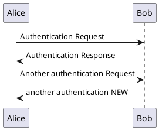
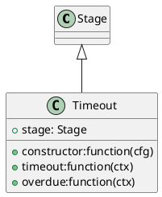

<!--   ....    -->

<!--    
$f(x)$
-->

```plantuml
@startuml
Alice -> Bob: Authentication Request
Bob --> Alice: Authentication Response

Alice -> Bob: Another authentication Request
Alice <-- Bob: another authentication NEW
@endum
```

```plantuml
@startuml

    Class Stage
    Class Timeout {
        +constructor:function(cfg)
        +timeout:function(ctx)
        +overdue:function(ctx)
        +stage: Stage
    }
     Stage <|-- Timeout

@enduml
```

